Simulations for specific regions of $2^{13}$ bp
========================================================

A comparison of several methods (multiseq, edgeR, DESeq, and hmm (to be included)) for a few specific regions of $2^{13}$ bp under difference simulations schemes. Simulations are based on the Encode CHipseq data for 2 tissues with 2 samples for each tissue.

In total, there are 4 simulation schemes:

1. Binomial model: region where there is peak (as determined by MACS) is selected. 2-fold differential expression between the 2 groups is simulated in the region where there is a peak. Data is sampled from the total reads pooled across all samples according to a binomial model. For null simulations, each sample $i$ has a $Bin(n_b,p_i)$ number of reads at base $b$, where $n_b$ is the number of reads at base $b$, and $p_i$ is determined by the relative sequencing depth, $p_i=depth_i/\sum_i depth_i$. For the alternative simulations, the only difference is in one of the groups, where we have a $Bin(n_b,p_i/2)$ number of reads sampled for individuals $i$ that group.

2. Multinomial model: essentially the same as above. Instead of independent Binomial counts for each individual $i$, we have a multinomial sampling scheme for all the samples at once. Here the vector $p$ is normalized, so that the differential expression may not be exactly 2-fold.

3. Beta-binomial model: modified from the original scheme to favor edgeR and DESeq more. First a baseline is estimated from the data. Then a 2-fold difference is created for the alternative signal, in the region where there is a peak. Define the ratio of the alternative signal to the null signal to be the vector $r$. For the null data, reads are sampled from a beta-binomial model using the same $p$ as in the binomial model (scaled depending on sequencing depth), with overdispersion parameter=0.01. For alternative data, the $p$ for the alternative data is given by $p_i*r_b$ for base pair $b$ in sample $i$ in the "alternative group. Reads are then sampled from a beta-binomial model based on the given $p$.

4. Negative binomial model: modified from the original scheme to favor edgeR and DESeq more. Again a baseline is estimated. Instead of using the effect estimate from multiseq however, a 2-fold difference is created for the alternative signal in the region of interest (peak), as with the beta-binomial model. The null signal and the alternative signal are then used to simulated negative binomial reads (null signal for all samples in null simulations, and both signals used in alternative simulations). Over-dispersion parameter is also set to be 0.01.


Results are presented below. There are 4 simulation scheme, with 4 regions for each scheme, giving a total of 16 roc plots. Black is z-score for multiseq, red is loglr for multiseq, green is edgeR, blue is DESeq


```r
#Region 21108890-21117081, beta-binomial
load("res_plot_betabin_21108890_21117081.Robj")

par(mfrow=c(2,1))

plot(res.4.reg$fpr,res.4.reg$tpr,type='l',ylim=c(0,1),xlim=c(0,1),xlab="FPR",ylab="TPR",main="ROC curve, size=4")
lines(res.4.lr$fpr,res.4.lr$tpr,col=2)
lines(res.4.edgeR$fpr,res.4.edgeR$tpr,col=3)
lines(res.4.DESeq$fpr,res.4.DESeq$tpr,col=4)
#lines(res.4.hmm.lr$fpr,res.4.hmm.lr$tpr,col=5)


plot(res.4.reg$fdr,res.4.reg$tp,type='l',xlim=c(0,0.2),ylim=c(0,100),xlab="FDR",ylab="Total # discoveries",main="Total # discoveries vs. FDR, size=4")
lines(res.4.lr$fdr,res.4.lr$tp,col=2)
lines(res.4.edgeR$fdr,res.4.edgeR$tp,col=3)
lines(res.4.DESeq$fdr,res.4.DESeq$tp,col=4)
#lines(res.4.hmm.lr$fdr,res.4.hmm.lr$tp,col=5)
abline(h=100,lty=3)
```

 


```r
#Region 21108890-21117081, binomial
load("res_plot_bin_21108890_21117081.Robj")

par(mfrow=c(2,1))

plot(res.4.reg$fpr,res.4.reg$tpr,type='l',ylim=c(0,1),xlim=c(0,1),xlab="FPR",ylab="TPR",main="ROC curve, size=4")
lines(res.4.lr$fpr,res.4.lr$tpr,col=2)
lines(res.4.edgeR$fpr,res.4.edgeR$tpr,col=3)
lines(res.4.DESeq$fpr,res.4.DESeq$tpr,col=4)
#lines(res.4.hmm.lr$fpr,res.4.hmm.lr$tpr,col=5)


plot(res.4.reg$fdr,res.4.reg$tp,type='l',xlim=c(0,0.2),ylim=c(0,100),xlab="FDR",ylab="Total # discoveries",main="Total # discoveries vs. FDR, size=4")
lines(res.4.lr$fdr,res.4.lr$tp,col=2)
lines(res.4.edgeR$fdr,res.4.edgeR$tp,col=3)
lines(res.4.DESeq$fdr,res.4.DESeq$tp,col=4)
#lines(res.4.hmm.lr$fdr,res.4.hmm.lr$tp,col=5)
abline(h=100,lty=3)
```

 


```r
#Region 21108890-21117081, multinomial
load("res_plot_multi_21108890_21117081.Robj")

par(mfrow=c(2,1))

plot(res.4.reg$fpr,res.4.reg$tpr,type='l',ylim=c(0,1),xlim=c(0,1),xlab="FPR",ylab="TPR",main="ROC curve, size=4")
lines(res.4.lr$fpr,res.4.lr$tpr,col=2)
lines(res.4.edgeR$fpr,res.4.edgeR$tpr,col=3)
lines(res.4.DESeq$fpr,res.4.DESeq$tpr,col=4)
#lines(res.4.hmm.lr$fpr,res.4.hmm.lr$tpr,col=5)


plot(res.4.reg$fdr,res.4.reg$tp,type='l',xlim=c(0,0.2),ylim=c(0,100),xlab="FDR",ylab="Total # discoveries",main="Total # discoveries vs. FDR, size=4")
lines(res.4.lr$fdr,res.4.lr$tp,col=2)
lines(res.4.edgeR$fdr,res.4.edgeR$tp,col=3)
lines(res.4.DESeq$fdr,res.4.DESeq$tp,col=4)
#lines(res.4.hmm.lr$fdr,res.4.hmm.lr$tp,col=5)
abline(h=100,lty=3)
```

 


```r
#Region 21108890-21117081, negative binomial
load("res_plot_negbin_21108890_21117081.Robj")

par(mfrow=c(2,1))

plot(res.4.reg$fpr,res.4.reg$tpr,type='l',ylim=c(0,1),xlim=c(0,1),xlab="FPR",ylab="TPR",main="ROC curve, size=4")
lines(res.4.lr$fpr,res.4.lr$tpr,col=2)
lines(res.4.edgeR$fpr,res.4.edgeR$tpr,col=3)
lines(res.4.DESeq$fpr,res.4.DESeq$tpr,col=4)
#lines(res.4.hmm.lr$fpr,res.4.hmm.lr$tpr,col=5)


plot(res.4.reg$fdr,res.4.reg$tp,type='l',xlim=c(0,0.2),ylim=c(0,100),xlab="FDR",ylab="Total # discoveries",main="Total # discoveries vs. FDR, size=4")
lines(res.4.lr$fdr,res.4.lr$tp,col=2)
lines(res.4.edgeR$fdr,res.4.edgeR$tp,col=3)
lines(res.4.DESeq$fdr,res.4.DESeq$tp,col=4)
#lines(res.4.hmm.lr$fdr,res.4.hmm.lr$tp,col=5)
abline(h=100,lty=3)
```

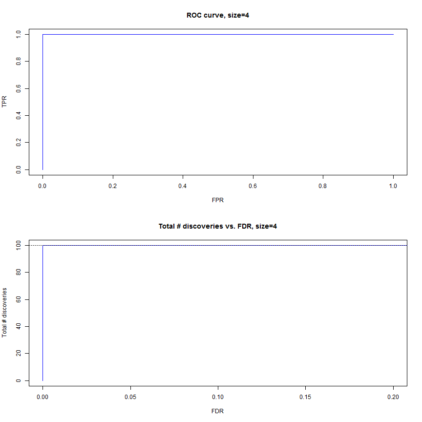 


```r
#Region 25795002-25803193, beta-binomial
load("res_plot_betabin_25795002_25803193.Robj")

par(mfrow=c(2,1))

plot(res.4.reg$fpr,res.4.reg$tpr,type='l',ylim=c(0,1),xlim=c(0,1),xlab="FPR",ylab="TPR",main="ROC curve, size=4")
lines(res.4.lr$fpr,res.4.lr$tpr,col=2)
lines(res.4.edgeR$fpr,res.4.edgeR$tpr,col=3)
lines(res.4.DESeq$fpr,res.4.DESeq$tpr,col=4)
#lines(res.4.hmm.lr$fpr,res.4.hmm.lr$tpr,col=5)


plot(res.4.reg$fdr,res.4.reg$tp,type='l',xlim=c(0,0.2),ylim=c(0,100),xlab="FDR",ylab="Total # discoveries",main="Total # discoveries vs. FDR, size=4")
lines(res.4.lr$fdr,res.4.lr$tp,col=2)
lines(res.4.edgeR$fdr,res.4.edgeR$tp,col=3)
lines(res.4.DESeq$fdr,res.4.DESeq$tp,col=4)
#lines(res.4.hmm.lr$fdr,res.4.hmm.lr$tp,col=5)
abline(h=100,lty=3)
```

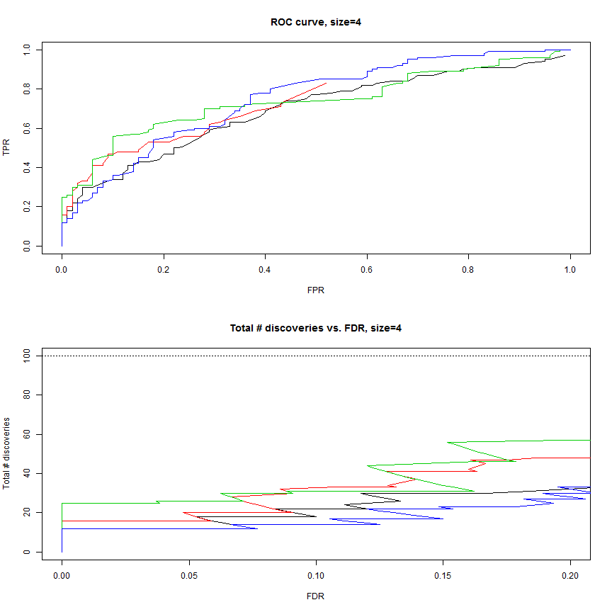 


```r
#Region 25795002-25803193, binomial
load("res_plot_bin_25795002_25803193.Robj")

par(mfrow=c(2,1))

plot(res.4.reg$fpr,res.4.reg$tpr,type='l',ylim=c(0,1),xlim=c(0,1),xlab="FPR",ylab="TPR",main="ROC curve, size=4")
lines(res.4.lr$fpr,res.4.lr$tpr,col=2)
lines(res.4.edgeR$fpr,res.4.edgeR$tpr,col=3)
lines(res.4.DESeq$fpr,res.4.DESeq$tpr,col=4)
#lines(res.4.hmm.lr$fpr,res.4.hmm.lr$tpr,col=5)


plot(res.4.reg$fdr,res.4.reg$tp,type='l',xlim=c(0,0.2),ylim=c(0,100),xlab="FDR",ylab="Total # discoveries",main="Total # discoveries vs. FDR, size=4")
lines(res.4.lr$fdr,res.4.lr$tp,col=2)
lines(res.4.edgeR$fdr,res.4.edgeR$tp,col=3)
lines(res.4.DESeq$fdr,res.4.DESeq$tp,col=4)
#lines(res.4.hmm.lr$fdr,res.4.hmm.lr$tp,col=5)
abline(h=100,lty=3)
```

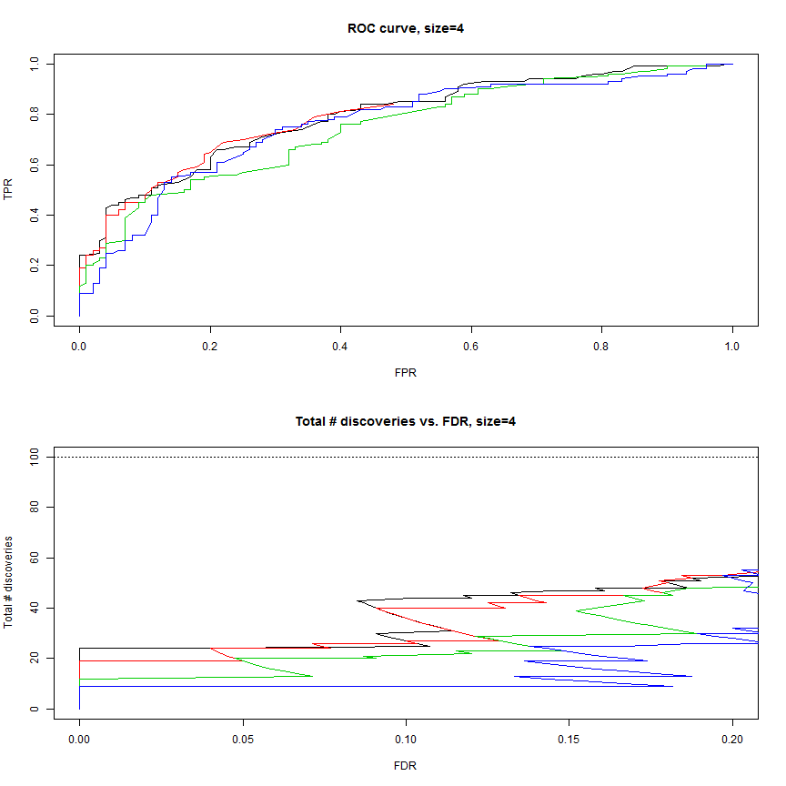 


```r
#Region 25795002-25803193, multinomial
load("res_plot_multi_25795002_25803193.Robj")

par(mfrow=c(2,1))

plot(res.4.reg$fpr,res.4.reg$tpr,type='l',ylim=c(0,1),xlim=c(0,1),xlab="FPR",ylab="TPR",main="ROC curve, size=4")
lines(res.4.lr$fpr,res.4.lr$tpr,col=2)
lines(res.4.edgeR$fpr,res.4.edgeR$tpr,col=3)
lines(res.4.DESeq$fpr,res.4.DESeq$tpr,col=4)
#lines(res.4.hmm.lr$fpr,res.4.hmm.lr$tpr,col=5)


plot(res.4.reg$fdr,res.4.reg$tp,type='l',xlim=c(0,0.2),ylim=c(0,100),xlab="FDR",ylab="Total # discoveries",main="Total # discoveries vs. FDR, size=4")
lines(res.4.lr$fdr,res.4.lr$tp,col=2)
lines(res.4.edgeR$fdr,res.4.edgeR$tp,col=3)
lines(res.4.DESeq$fdr,res.4.DESeq$tp,col=4)
#lines(res.4.hmm.lr$fdr,res.4.hmm.lr$tp,col=5)
abline(h=100,lty=3)
```

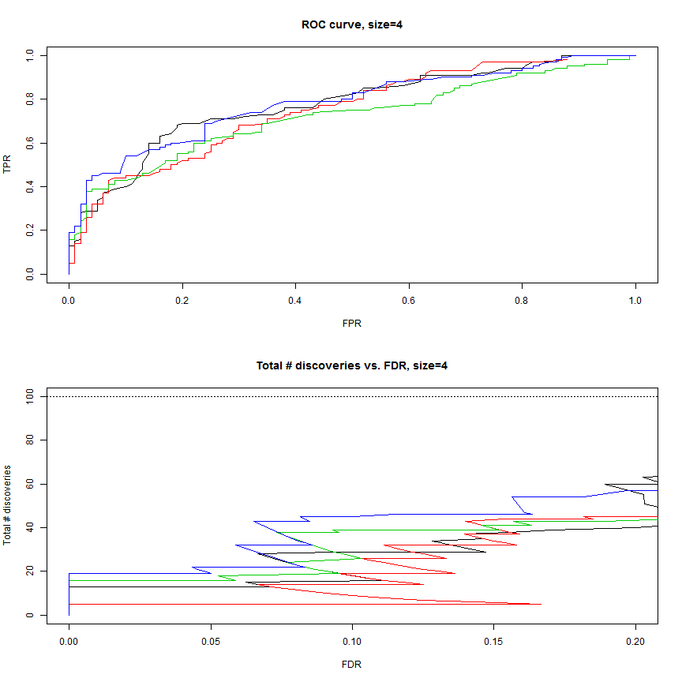 


```r
#Region 25795002-25803193, negative binomial
load("res_plot_negbin_25795002_25803193.Robj")

par(mfrow=c(2,1))

plot(res.4.reg$fpr,res.4.reg$tpr,type='l',ylim=c(0,1),xlim=c(0,1),xlab="FPR",ylab="TPR",main="ROC curve, size=4")
lines(res.4.lr$fpr,res.4.lr$tpr,col=2)
lines(res.4.edgeR$fpr,res.4.edgeR$tpr,col=3)
lines(res.4.DESeq$fpr,res.4.DESeq$tpr,col=4)
#lines(res.4.hmm.lr$fpr,res.4.hmm.lr$tpr,col=5)


plot(res.4.reg$fdr,res.4.reg$tp,type='l',xlim=c(0,0.2),ylim=c(0,100),xlab="FDR",ylab="Total # discoveries",main="Total # discoveries vs. FDR, size=4")
lines(res.4.lr$fdr,res.4.lr$tp,col=2)
lines(res.4.edgeR$fdr,res.4.edgeR$tp,col=3)
lines(res.4.DESeq$fdr,res.4.DESeq$tp,col=4)
#lines(res.4.hmm.lr$fdr,res.4.hmm.lr$tp,col=5)
abline(h=100,lty=3)
```

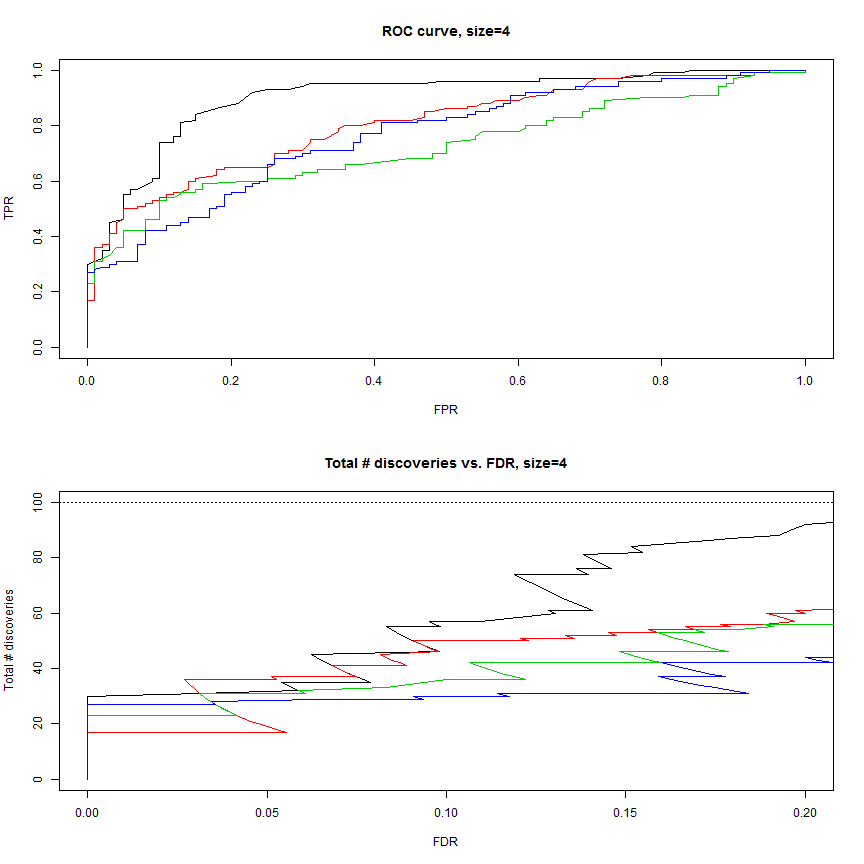 


```r
#Region 27954986-27963177, beta-binomial
load("res_plot_betabin_27954986_27963177.Robj")

par(mfrow=c(2,1))

plot(res.4.reg$fpr,res.4.reg$tpr,type='l',ylim=c(0,1),xlim=c(0,1),xlab="FPR",ylab="TPR",main="ROC curve, size=4")
lines(res.4.lr$fpr,res.4.lr$tpr,col=2)
lines(res.4.edgeR$fpr,res.4.edgeR$tpr,col=3)
lines(res.4.DESeq$fpr,res.4.DESeq$tpr,col=4)
#lines(res.4.hmm.lr$fpr,res.4.hmm.lr$tpr,col=5)


plot(res.4.reg$fdr,res.4.reg$tp,type='l',xlim=c(0,0.2),ylim=c(0,100),xlab="FDR",ylab="Total # discoveries",main="Total # discoveries vs. FDR, size=4")
lines(res.4.lr$fdr,res.4.lr$tp,col=2)
lines(res.4.edgeR$fdr,res.4.edgeR$tp,col=3)
lines(res.4.DESeq$fdr,res.4.DESeq$tp,col=4)
#lines(res.4.hmm.lr$fdr,res.4.hmm.lr$tp,col=5)
abline(h=100,lty=3)
```

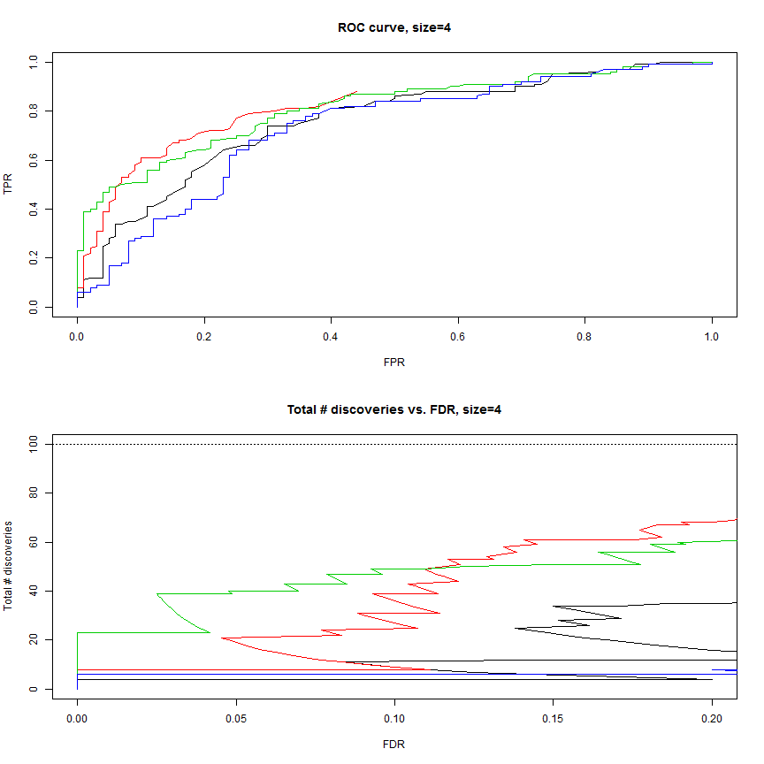 


```r
#Region 27954986-27963177, binomial
load("res_plot_bin_27954986_27963177.Robj")

par(mfrow=c(2,1))

plot(res.4.reg$fpr,res.4.reg$tpr,type='l',ylim=c(0,1),xlim=c(0,1),xlab="FPR",ylab="TPR",main="ROC curve, size=4")
lines(res.4.lr$fpr,res.4.lr$tpr,col=2)
lines(res.4.edgeR$fpr,res.4.edgeR$tpr,col=3)
lines(res.4.DESeq$fpr,res.4.DESeq$tpr,col=4)
#lines(res.4.hmm.lr$fpr,res.4.hmm.lr$tpr,col=5)


plot(res.4.reg$fdr,res.4.reg$tp,type='l',xlim=c(0,0.2),ylim=c(0,100),xlab="FDR",ylab="Total # discoveries",main="Total # discoveries vs. FDR, size=4")
lines(res.4.lr$fdr,res.4.lr$tp,col=2)
lines(res.4.edgeR$fdr,res.4.edgeR$tp,col=3)
lines(res.4.DESeq$fdr,res.4.DESeq$tp,col=4)
#lines(res.4.hmm.lr$fdr,res.4.hmm.lr$tp,col=5)
abline(h=100,lty=3)
```

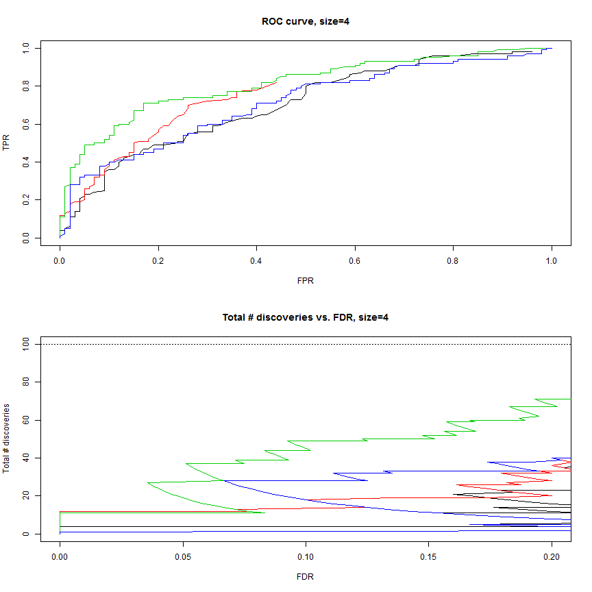 


```r
#Region 27954986-27963177, multinomial
load("res_plot_multi_27954986_27963177.Robj")

par(mfrow=c(2,1))

plot(res.4.reg$fpr,res.4.reg$tpr,type='l',ylim=c(0,1),xlim=c(0,1),xlab="FPR",ylab="TPR",main="ROC curve, size=4")
lines(res.4.lr$fpr,res.4.lr$tpr,col=2)
lines(res.4.edgeR$fpr,res.4.edgeR$tpr,col=3)
lines(res.4.DESeq$fpr,res.4.DESeq$tpr,col=4)
#lines(res.4.hmm.lr$fpr,res.4.hmm.lr$tpr,col=5)


plot(res.4.reg$fdr,res.4.reg$tp,type='l',xlim=c(0,0.2),ylim=c(0,100),xlab="FDR",ylab="Total # discoveries",main="Total # discoveries vs. FDR, size=4")
lines(res.4.lr$fdr,res.4.lr$tp,col=2)
lines(res.4.edgeR$fdr,res.4.edgeR$tp,col=3)
lines(res.4.DESeq$fdr,res.4.DESeq$tp,col=4)
#lines(res.4.hmm.lr$fdr,res.4.hmm.lr$tp,col=5)
abline(h=100,lty=3)
```

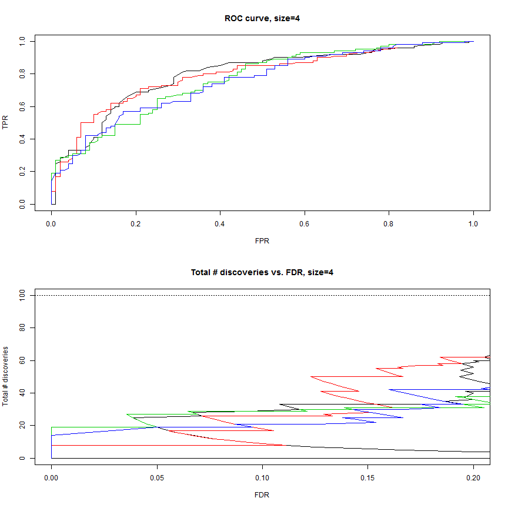 


```r
#Region 27954986-27963177, negative binomial
load("res_plot_negbin_27954986_27963177.Robj")

par(mfrow=c(2,1))

plot(res.4.reg$fpr,res.4.reg$tpr,type='l',ylim=c(0,1),xlim=c(0,1),xlab="FPR",ylab="TPR",main="ROC curve, size=4")
lines(res.4.lr$fpr,res.4.lr$tpr,col=2)
lines(res.4.edgeR$fpr,res.4.edgeR$tpr,col=3)
lines(res.4.DESeq$fpr,res.4.DESeq$tpr,col=4)
#lines(res.4.hmm.lr$fpr,res.4.hmm.lr$tpr,col=5)


plot(res.4.reg$fdr,res.4.reg$tp,type='l',xlim=c(0,0.2),ylim=c(0,100),xlab="FDR",ylab="Total # discoveries",main="Total # discoveries vs. FDR, size=4")
lines(res.4.lr$fdr,res.4.lr$tp,col=2)
lines(res.4.edgeR$fdr,res.4.edgeR$tp,col=3)
lines(res.4.DESeq$fdr,res.4.DESeq$tp,col=4)
#lines(res.4.hmm.lr$fdr,res.4.hmm.lr$tp,col=5)
abline(h=100,lty=3)
```

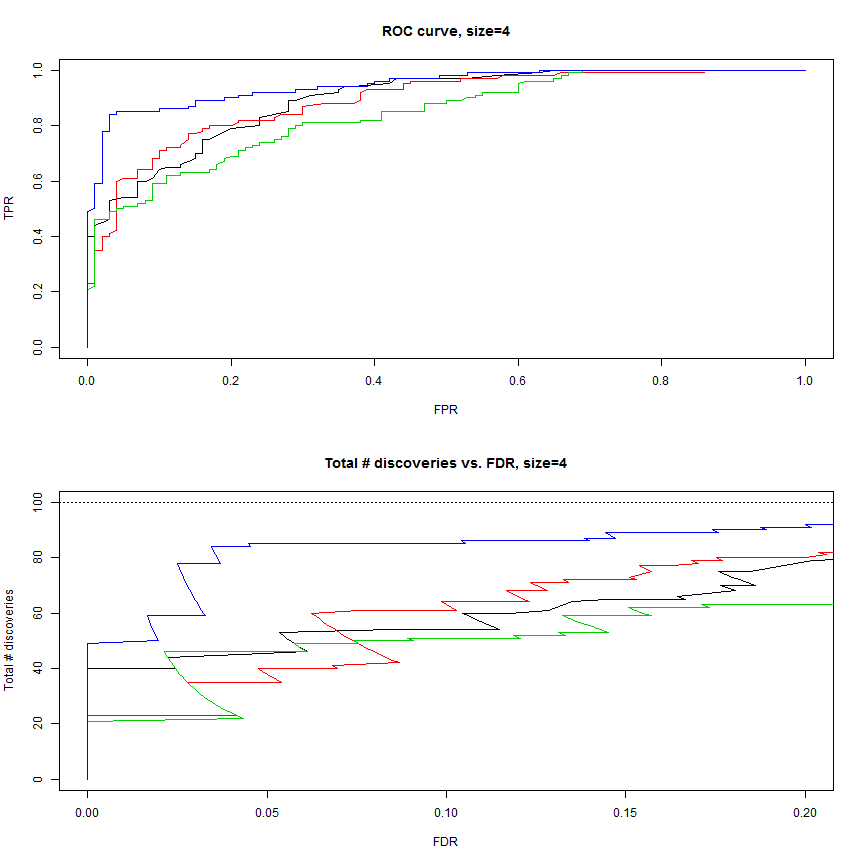 


```r
#Region 206962543-206970734, beta-binomial
load("res_plot_betabin_206962543_206970734.Robj")

par(mfrow=c(2,1))

plot(res.4.reg$fpr,res.4.reg$tpr,type='l',ylim=c(0,1),xlim=c(0,1),xlab="FPR",ylab="TPR",main="ROC curve, size=4")
lines(res.4.lr$fpr,res.4.lr$tpr,col=2)
lines(res.4.edgeR$fpr,res.4.edgeR$tpr,col=3)
lines(res.4.DESeq$fpr,res.4.DESeq$tpr,col=4)
#lines(res.4.hmm.lr$fpr,res.4.hmm.lr$tpr,col=5)


plot(res.4.reg$fdr,res.4.reg$tp,type='l',xlim=c(0,0.2),ylim=c(0,100),xlab="FDR",ylab="Total # discoveries",main="Total # discoveries vs. FDR, size=4")
lines(res.4.lr$fdr,res.4.lr$tp,col=2)
lines(res.4.edgeR$fdr,res.4.edgeR$tp,col=3)
lines(res.4.DESeq$fdr,res.4.DESeq$tp,col=4)
#lines(res.4.hmm.lr$fdr,res.4.hmm.lr$tp,col=5)
abline(h=100,lty=3)
```

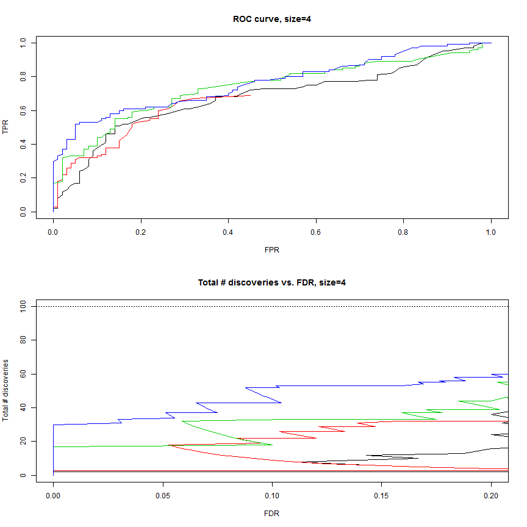 


```r
#Region 206962543-206970734, binomial
load("res_plot_bin_206962543_206970734.Robj")

par(mfrow=c(2,1))

plot(res.4.reg$fpr,res.4.reg$tpr,type='l',ylim=c(0,1),xlim=c(0,1),xlab="FPR",ylab="TPR",main="ROC curve, size=4")
lines(res.4.lr$fpr,res.4.lr$tpr,col=2)
lines(res.4.edgeR$fpr,res.4.edgeR$tpr,col=3)
lines(res.4.DESeq$fpr,res.4.DESeq$tpr,col=4)
#lines(res.4.hmm.lr$fpr,res.4.hmm.lr$tpr,col=5)


plot(res.4.reg$fdr,res.4.reg$tp,type='l',xlim=c(0,0.2),ylim=c(0,100),xlab="FDR",ylab="Total # discoveries",main="Total # discoveries vs. FDR, size=4")
lines(res.4.lr$fdr,res.4.lr$tp,col=2)
lines(res.4.edgeR$fdr,res.4.edgeR$tp,col=3)
lines(res.4.DESeq$fdr,res.4.DESeq$tp,col=4)
#lines(res.4.hmm.lr$fdr,res.4.hmm.lr$tp,col=5)
abline(h=100,lty=3)
```

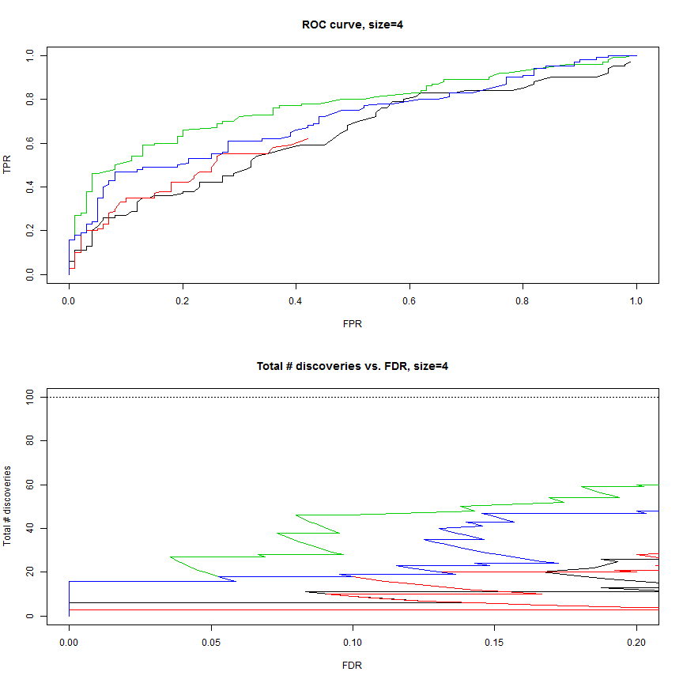 


```r
#Region 206962543-206970734, multinomial
load("res_plot_multi_206962543_206970734.Robj")

par(mfrow=c(2,1))

plot(res.4.reg$fpr,res.4.reg$tpr,type='l',ylim=c(0,1),xlim=c(0,1),xlab="FPR",ylab="TPR",main="ROC curve, size=4")
lines(res.4.lr$fpr,res.4.lr$tpr,col=2)
lines(res.4.edgeR$fpr,res.4.edgeR$tpr,col=3)
lines(res.4.DESeq$fpr,res.4.DESeq$tpr,col=4)
#lines(res.4.hmm.lr$fpr,res.4.hmm.lr$tpr,col=5)


plot(res.4.reg$fdr,res.4.reg$tp,type='l',xlim=c(0,0.2),ylim=c(0,100),xlab="FDR",ylab="Total # discoveries",main="Total # discoveries vs. FDR, size=4")
lines(res.4.lr$fdr,res.4.lr$tp,col=2)
lines(res.4.edgeR$fdr,res.4.edgeR$tp,col=3)
lines(res.4.DESeq$fdr,res.4.DESeq$tp,col=4)
#lines(res.4.hmm.lr$fdr,res.4.hmm.lr$tp,col=5)
abline(h=100,lty=3)
```

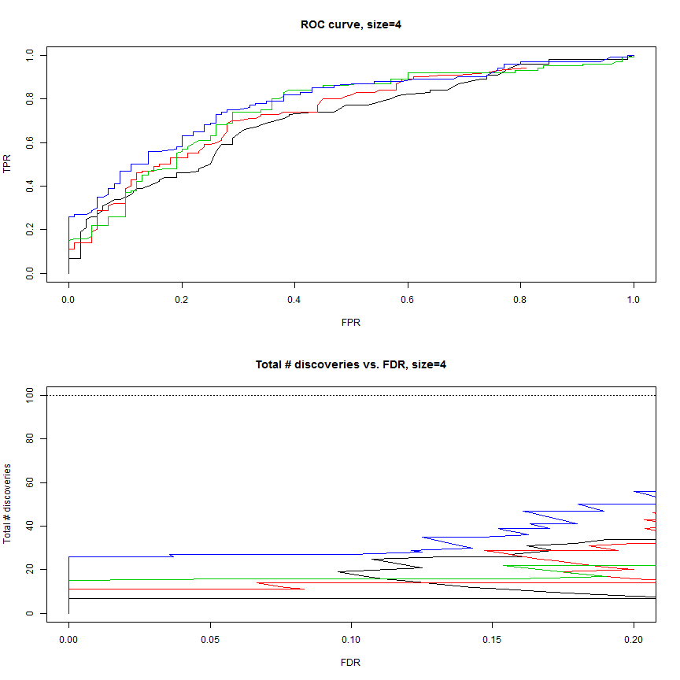 


```r
#Region 206962543-206970734, negative binomial
load("res_plot_negbin_206962543_206970734.Robj")

par(mfrow=c(2,1))

plot(res.4.reg$fpr,res.4.reg$tpr,type='l',ylim=c(0,1),xlim=c(0,1),xlab="FPR",ylab="TPR",main="ROC curve, size=4")
lines(res.4.lr$fpr,res.4.lr$tpr,col=2)
lines(res.4.edgeR$fpr,res.4.edgeR$tpr,col=3)
lines(res.4.DESeq$fpr,res.4.DESeq$tpr,col=4)
#lines(res.4.hmm.lr$fpr,res.4.hmm.lr$tpr,col=5)


plot(res.4.reg$fdr,res.4.reg$tp,type='l',xlim=c(0,0.2),ylim=c(0,100),xlab="FDR",ylab="Total # discoveries",main="Total # discoveries vs. FDR, size=4")
lines(res.4.lr$fdr,res.4.lr$tp,col=2)
lines(res.4.edgeR$fdr,res.4.edgeR$tp,col=3)
lines(res.4.DESeq$fdr,res.4.DESeq$tp,col=4)
#lines(res.4.hmm.lr$fdr,res.4.hmm.lr$tp,col=5)
abline(h=100,lty=3)
```

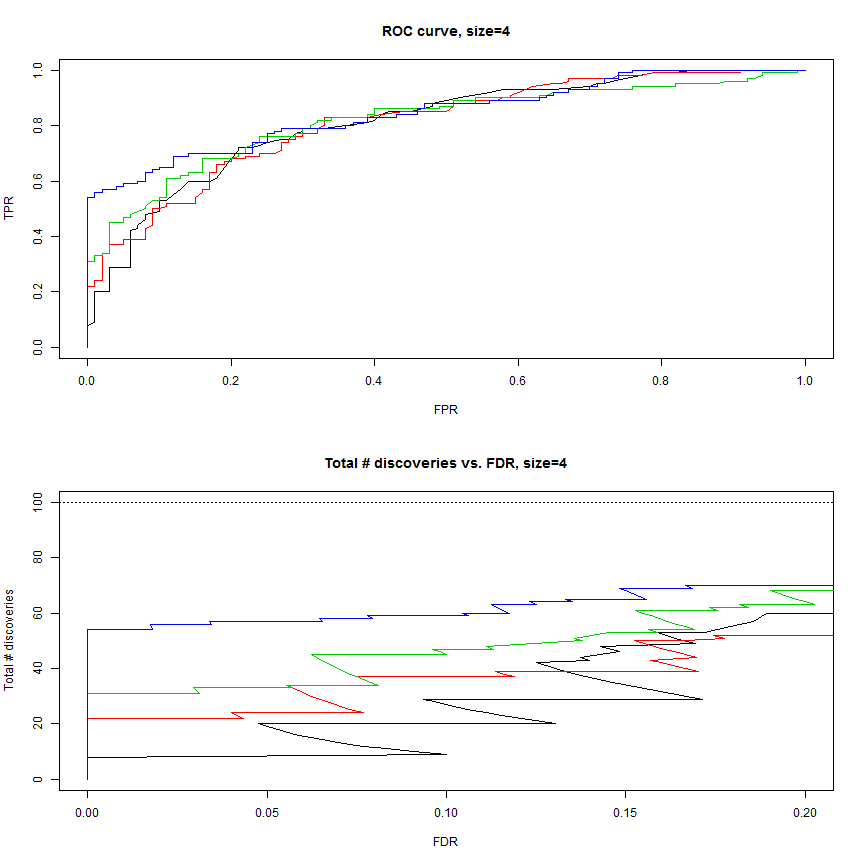 
